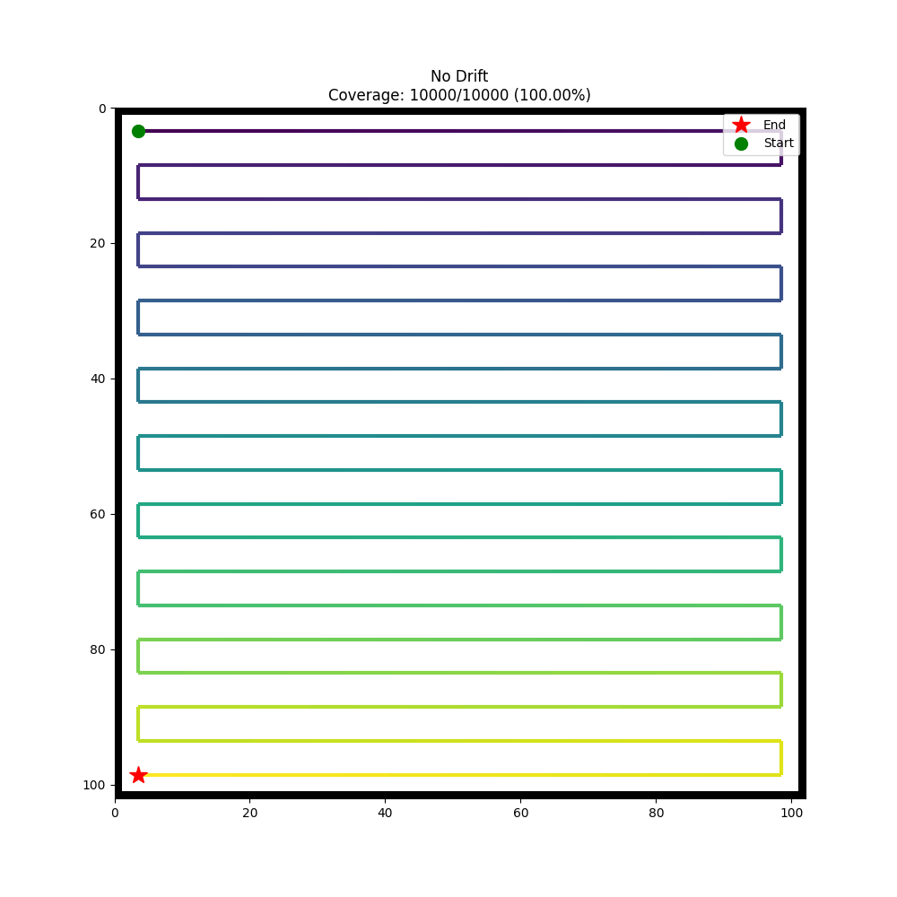
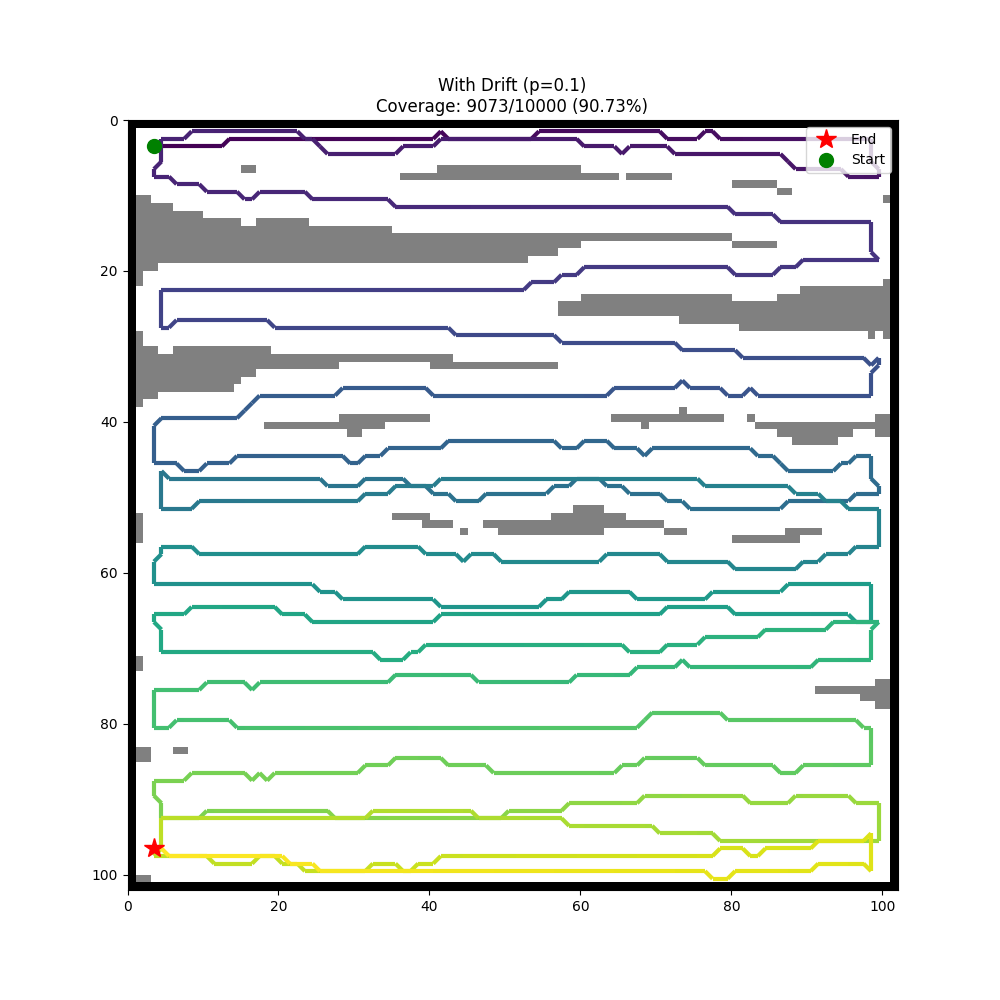

# Underwater Autonomous Vehicle Coverage Path Planning
A project exploring path planning for underwater autonomous vehicles facing drift and localization errors.

## Features
- Lawnmower path planning
- Drift simulation
- Localization error simulation
- Coverage visualization
- TODOs:
    - [ ] Add localization action to correct error
    - [ ] Add tests
    - [ ] Add documentation and project structure

## Installation
The project requires `Python 3` and uses `uv` for dependency management.

Steps:
1. Clone the repository
`git clone git@github.com:arnob2601/uav-cpp.git`
2. Install dependencies
`uv pip install -r requirements.txt`

## Usage
Run the simulation
`uv run simulation.py`

### Sample Outputs

| Considering perfect localization and no drift | Considering drift and localization error |
|--------------|---------------|
|  |  |

